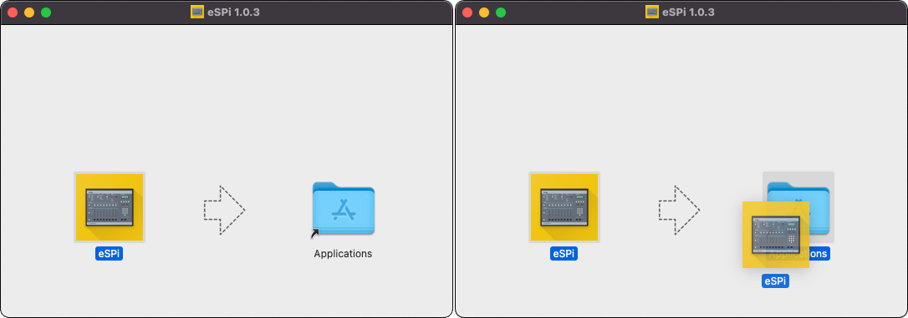

# Installation
This tutorial will teach you everything there is to know about making music with eSPi (and/or the SP1200) 
But first let's start by installing eSPi, follow the instructions below for your platform.

### Installation (Mac OS)
Download the Mac installer by clicking [this link](https://low-hiss.com/eSPi-1.0.3.dmg).  
Once downloaded, open the file and drag the eSPi icon onto the Applications folder icon as seen below:

### Installation (iPad)
TODO

### Installation (Windows)
TODO

### Installation (Linux)
TODO

### Installation (Android)
TODO
