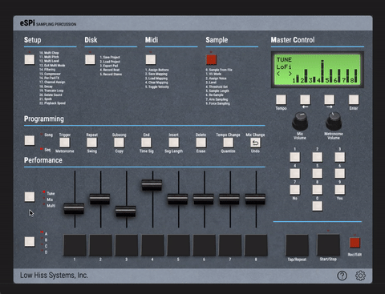

# Adjusting Pitch & Volume

**Pitch**: Click the *Tune/Mix/Multi* button in the programming section once to access the screen that allows you to pitch your sounds up and down
with that sweet, sweet SP-1200 aliasing. 

**Volume**: Click the *Tune/Mix/Multi* button once again to access the Mix screen, and adjust the volume of each pad using the faders like before. 

 

*ℹ️ **Note**:*  
You can switch between the grimy SP1200 pitch and a regular clean pitch by using the left/right arrows in the *Tune* screen.
The screen will reflect that change by displaying *"LoFi"* or *"HiFi"*
