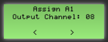
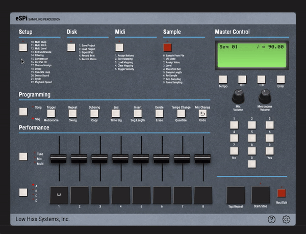
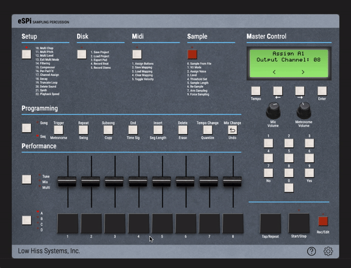

# Channel Assign (Mute Groups)
A very important concept to understand with the SP1200 and the eSPi is the channel assign. 
On one hand if you want several pads to cut each-other off, they need to be on the same channel. 
On the other hand, if you want several pads to play simultaneously over each-other, then you need to set them to different
channels.

To change a pad's channel, you need to access the *Channel Assign* menu. 

**You have several ways to access it**:

  
<b>Click the <i>Setup</i> button top left, then enter 17 on the number pad</b>

  
<b>Click the <i>Setup</i> button, then use the right arrow to navigate to the <i>Channel Assign</i> screen</b>

  
<b>Click directly on <i>"17. Channel Assign"</i> below the Setup button (<i>not available on Android</i>)</b>

 

**Assigning a Pad to a Channel**:  Once you are in the *Channel Assign* screen, simply hit the pad you want to change the channel of (the screen will display *"Assign B3"* if you hit the 3rd pad of bank B for example) 
Then input the channel number you want to assign it to using the numpad or the arrows.

 

*ℹ️ **Note**:*  The eSPi has 32 channels you can assign pads to, this means that you can have all 32 pads play simultaneously if you want to. 
The channels are all unfiltered, the filters are adjusted separately.

*ℹ️ **Note**:*  
The SP-1200 has 8 channels, they have fixed low-pass filters on them except for channels 7 & 8 which are unfiltered.
