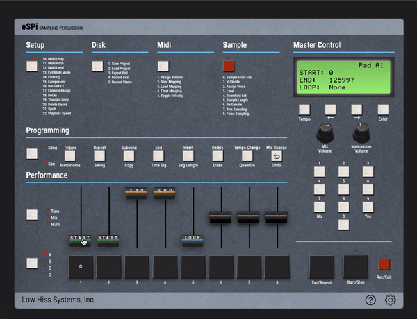

# Truncating Samples

To truncate the start & end of a sample, you need to access the *Truncate* menu. 

You have several ways to reach this menu:

  
<b>Click the <i>Setup</i> button then enter 19 using the numpad</b>

  
<b>Click the <i>Setup</i> button then use the right arrow to navigate to the <i>Truncate</i> menu</b>

  
<b>Directly click on <i>"19 - Truncate Loop"</i> below the <i>Setup</i> button</b>

*(Not available on Android)*

Once in the Truncate menu, hit the pad you want to truncate. 
Then you'll use the faders to truncate the sample as follows:
* **Fader #1**: to make coarse adjustments to the start point of the sample
* **Fader #2**: to make fine adjustments to the start point of the sample
* **Fader #3**: to make coarse adjustments to the end point of the sample
* **Fader #4**: to make fine adjustments to the end point of the sample
* **Fader #5**: to select a point in the sample after which the rest will loop several times then decay  *(this was used to make samples seem longer on the SP1200 due to the sample time limitations)*

When truncating samples longer than 2.5 seconds *(the max length of a single sample on the SP1200)*, you may find you need more precision when truncating. 
To get more precise adjustments, get a rough start and end point then click the *Enter* button to make the current truncation permanent. 
This will make the sample shorter, thus allowing you to get more precise start/end points.
