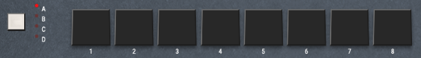
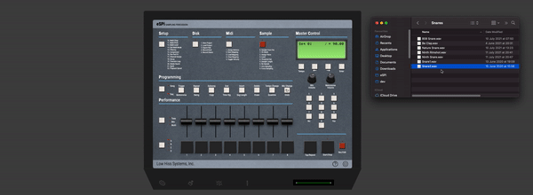
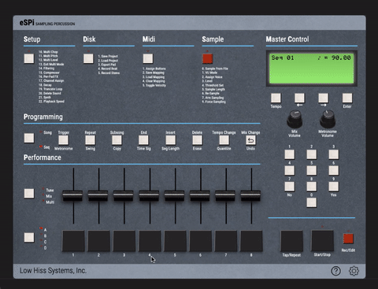

# Importing Samples

You can import up to 32 sounds into the eSPi *(or the SP1200)*, it has 4 banks of 8 pads each. 

There are several ways to import your samples on the eSPi's pads:

  
<b>Drag & Drop</b>

The easiest way, simply drag and drop an audio file from your files to any of the pads

  
<b>Right Click &rarr; Load Sound</b>

  Simply right-click the desired pad and select *Load Sound* from the popup menu

  

  
<b>Sampling</b>

You can also sample from an external source or even sample parts from an audio file.  But we'll get to this in the *Sampling* part of the tutorial

