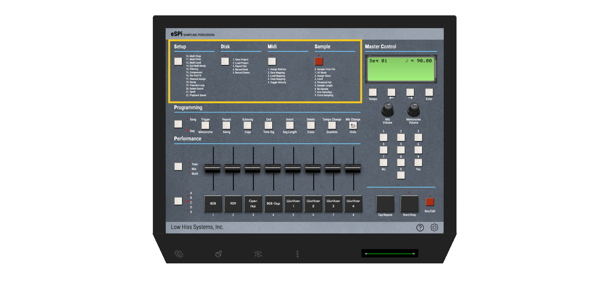
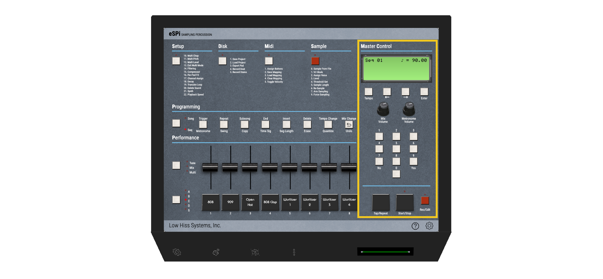
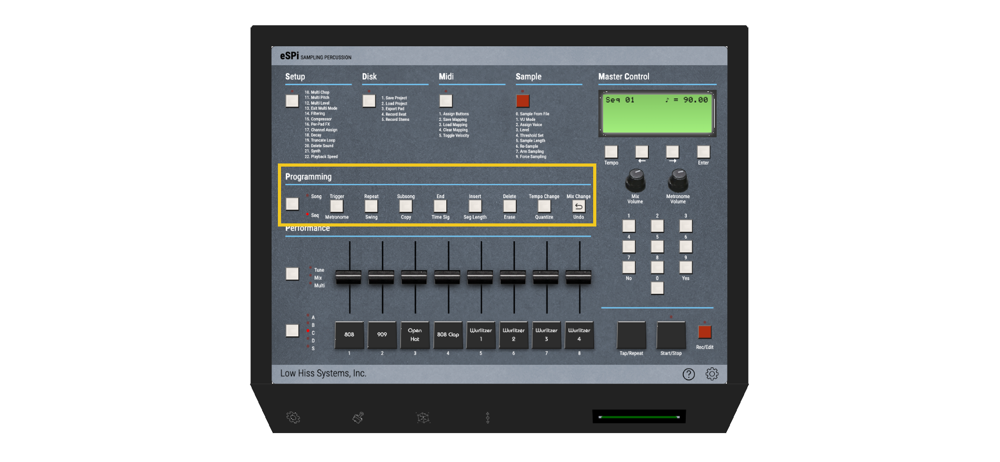
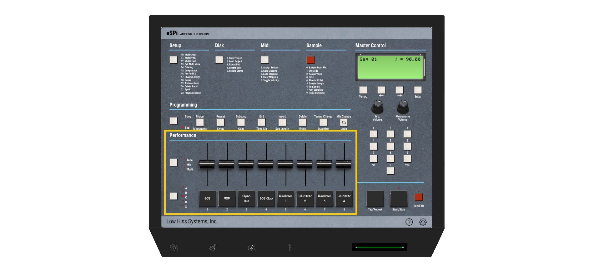

# Overview
The user interface is divided into 4 sections:
* **Main Menus**: Located at the top, those 4 buttons are used to access the main menus 
(*Setup*, *Disk*, *Midi* & *Sample*). The *Setup* button will especially be used very often. 

* **Master Control**: Located on the right, this section contains the LCD display and all the buttons used to navigate the menus (arrows, number pad, etc...) 

  

* **Programming**: Located below the main menus, this section contains all the menus related to the sequencer. 
This is where you'll set the swing, the quantizing, segment length and much more. 

  

* **Performance**: Located below the programming section, this section contains the pads, faders and bank button and this is where 
you'll actually play your sounds and set their pitch, volume and more. 

  
